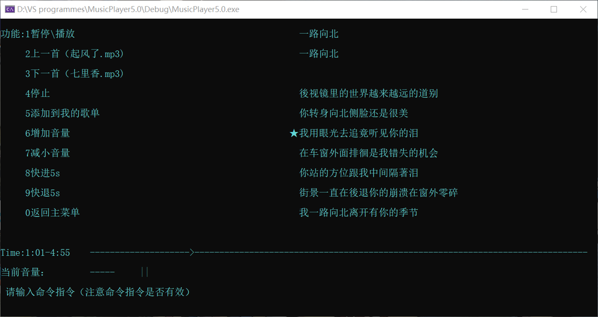

# MP3_music_player
This is an MP3 project based on C. Core files are `MusicPlayer.cpp` and `MusicPlayer.h`.

## Functional Requirements Realized
- Get MP3 file info
- Music play/pause/stop
- Show lyrics in a rolling style
- Play last/next song
- Create and save playlist
- Get music length and play progress
- Select play mode
- Control volume
- Generate log

## Other Resources
We also privided our presentation slides and the screen record. We highly recommend you to go through these two files if you are interested in our projhect. If you are a student at SCU and would like to get more documents, please feel free to contact me :)

## Error Shooting
If the files are opened with peculiar code in their comments, you may have to reopen them with other Encodings that support Chinese well.